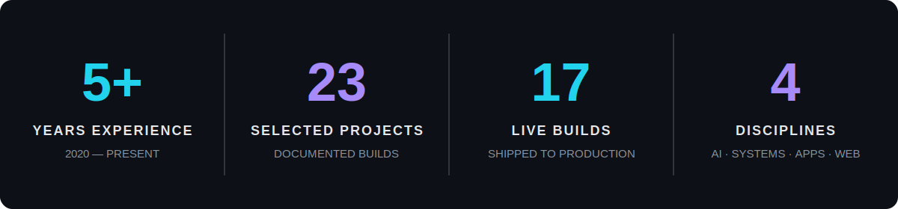

<div align="center">


<a href="https://readme-typing-svg.demolab.com">
  
</a>

<p>
  <a href="https://dzikri.ziksite.my.id"></a>
  <a href="https://id.linkedin.com/in/dzikrii"></a>
  <a href="mailto:dzikri1990@gmail.com"></a>
  <a href="https://wa.me/6289630557191"></a>
</p>


</div>

## I turn business complexity into working systems.

I'm a Jakarta-based developer and technology lead working across **web development, internal platforms, AI automation, and digital transformation**. I don't stop at a polished interface—I map the workflow, connect the data, build the system, and make sure it solves the operational problem behind the brief.

Today, I lead technology initiatives at **Banana Digital Boost**, build IT systems and automation for **Foodstocks**, and continue shipping digital products for organizations across finance, legal, healthcare, media, transport, retail, and public-sector-adjacent industries.

<br />



<p align="center"><sub>Figures are derived from the projects and career timeline documented in my portfolio source.</sub></p>

## What I build

<table>
  <tr>
    <td width="50%" valign="top">
      <h3>🤖 AI & Automation</h3>
      Grounded AI agents, n8n workflows, WhatsApp automation, calendar booking, RAG pipelines, and operational alerts built around real business data.
    </td>
    <td width="50%" valign="top">
      <h3>🧩 Internal Systems</h3>
      ERP, purchasing intelligence, ticketing, reseller portals, LMS, and role-based dashboards that replace spreadsheets and disconnected tools.
    </td>
  </tr>
  <tr>
    <td width="50%" valign="top">
      <h3>⚡ Web Applications</h3>
      Product-focused applications with AI integrations, clear workflows, responsive interfaces, and scalable data architecture.
    </td>
    <td width="50%" valign="top">
      <h3>🌐 Business Websites</h3>
      Fast, conversion-aware websites for regulated firms, B2B companies, healthcare, agencies, property, transport, and e-commerce.
    </td>
  </tr>
</table>

## Selected work, measured by outcomes

<details open>
  <summary><b>🤖 AI Sales Agent — WhatsApp automation that never sleeps</b></summary>
  <br />

  A natural-sounding sales agent that answers prospects, qualifies needs, quotes from verified business data, logs leads, and books meetings directly into Google Calendar.

  **24/7 auto-reply** · **Grounded RAG answers** · **Automatic calendar booking**

  `n8n` `OpenAI GPT-4o-mini` `Supabase pgvector` `WAHA` `Google Calendar` `PostgreSQL` `Self-hosted VPS`
</details>

<details open>
  <summary><b>📄 CV ATS Builder — an AI resume product built for speed</b></summary>
  <br />

  A bilingual, AI-assisted resume builder with live preview, one-click optimization, and a clean single-column PDF export designed for applicant tracking systems.

  **50K+ resumes built** · **Under 10 minutes to finish** · **95% reported ATS pass rate**

  `Next.js` `Tailwind CSS` `AI Integration` `PDF Export`
</details>

<details>
  <summary><b>📦 Purchasing Intelligence — decisions backed by 200+ SKUs</b></summary>
  <br />

  A purchasing analytics system with reorder-point and EOQ calculations, ABC classification, true COGS, supplier scorecards, and automated stock alerts.

  **200+ SKUs tracked** · **Hourly warehouse sync** · **Automated reorder alerts**

  `Next.js` `Redis` `REST API` `Email & WhatsApp Alerts`
</details>

<details>
  <summary><b>🛠️ IT Operations Dashboard — zero lost tickets across two companies</b></summary>
  <br />

  A structured ticketing and task platform replacing scattered WhatsApp requests and verbal briefs, with workload, priority, and team-performance visibility.

  **2 companies served** · **30+ active users** · **100% of requests tracked as tickets**

  `Next.js` `Prisma` `NextAuth` `Role-based Access`
</details>

<details>
  <summary><b>📈 Boost Engine — one operating system for an agency</b></summary>
  <br />

  An internal agency platform replacing ClickUp, Looker, and fragmented WhatsApp workflows with role-based home screens, project management, client health, and forecasting.

  **3 tools consolidated into 1** · **7 role dashboards** · **8-month revenue forecast**

  `Next.js` `PostgreSQL` `Recharts` `Realtime Data` `Row-level Security`
</details>

<details>
  <summary><b>🧠 Foodstocks Hub — one source of truth for an omnichannel business</b></summary>
  <br />

  An internal ERP unifying sales, reseller CRM, inventory, purchasing, and finance so every team works from the same automatically updated data.

  **8 sales channels unified** · **5 spreadsheets replaced by 1 system** · **Single source of truth**

  `Next.js` `PostgreSQL` `Prisma` `Automated Reporting`
</details>

### More proof from shipped websites

| Sector / build | Evidence from the project |
|---|---|
| Nationwide media agency | **35+ cities** covered across **21 shipped pages** |
| Defense MRO corporate site | Bilingual **ID / EN**, **95/100 SEO score**, 10-second credibility test |
| Investment management firm | OJK-regulated context, mobile-ready experience, **95/100 SEO score** |
| Technology consultancy | Government and BUMN focus with **<2s load time** |
| Healthcare platform | **38% faster load**, **95/100 SEO score**, 24/7 information access |
| F&B reseller landing page | **+30% partner signups**, **50+ products**, one-step onboarding |
| ISP campaign website | **+42% campaign engagement** with **<2s load time** |
| Digital agency website | **+35% consultation inquiries** and **97/100 performance** |

> Client names and brand identities remain confidential where required. The portfolio focuses on the problem, system, implementation, and outcome.

## Technology I use to ship

<div align="center">
  
  <br /><br />
  
</div>

<br />

<div align="center">
  
  
  
  
</div>

## Career signal

```text
2025 — Present  Head of New Technology · Banana Digital Boost
2025 — Present  IT Engineer · Foodstocks
2024            IT Network · PT Telkom Akses
2023 — 2024     UI/UX Design · GMF AeroAsia
2021 — 2023     Computer Lab Assistant · Universitas Serang Raya
2020 — 2022     Freelance Website Developer
```

My work has moved from hands-on technical support and network planning into UI/UX, product development, automation, system integration, and technology leadership. That range helps me see both the interface people use and the infrastructure that keeps the business moving.

## GitHub activity

<div align="center">
  
  
</div>

<div align="center">
  
</div>

## Watch my contributions get eaten 🐍

<div align="center">
  <picture>
    <source media="(prefers-color-scheme: dark)" srcset="https://raw.githubusercontent.com/dzikri/dzikri/output/github-contribution-grid-snake-dark.svg" />
    <source media="(prefers-color-scheme: light)" srcset="https://raw.githubusercontent.com/dzikri/dzikri/output/github-contribution-grid-snake.svg" />
    
  </picture>
</div>

---

<div align="center">

### Have a complex problem worth solving?

I can help turn it into a clear, scalable digital system.

**[Explore all projects](https://dzikri.ziksite.my.id) · [Start a conversation](https://wa.me/6289630557191) · [Connect on LinkedIn](https://id.linkedin.com/in/dzikrii)**

<sub>Strategy in the thinking. Precision in the build. Outcomes in the real world.</sub>


</div>
